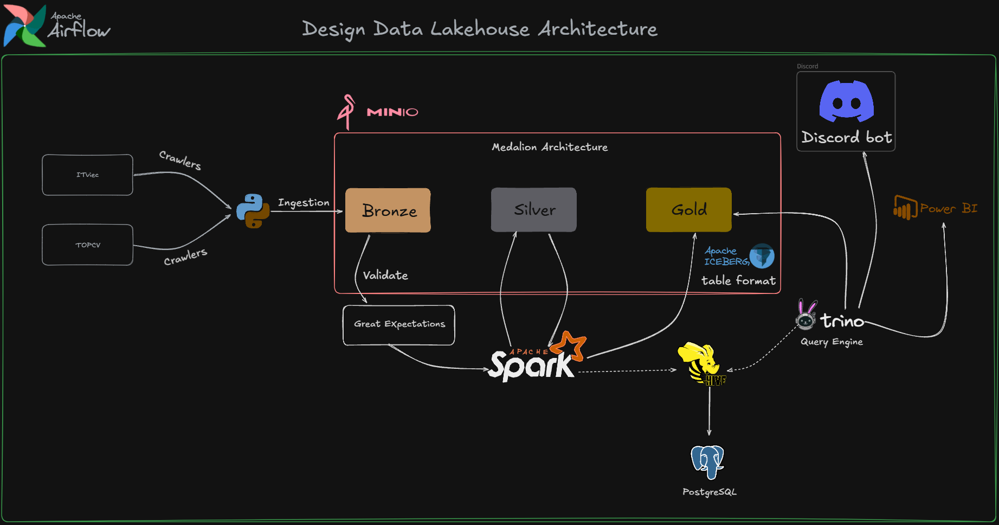

# 🚀 DataLens Data Lakehouse: Vietnam IT Job Market


## 📌 Introduction
This is an End-to-End Data Engineering portfolio project. It automatically scrapes IT job listings in Vietnam (ITviec, TopCV), processes the data through a Medallion Architecture (Bronze -> Silver -> Gold) using Apache Spark and Apache Iceberg, and visualizes market insights. The pipeline also includes a Discord Bot for real-time high-salary job alerts.

## 🏗️ Architecture & Data Flow

1. **Ingestion (Crawlers):** Python bots (using `camoufox`/`curl_cffi` to bypass Cloudflare) scrape job data daily and upload raw JSON files to MinIO.
2. **Data Lakehouse (Medallion Architecture):**
   - **Bronze Layer (Raw):** Stores raw JSON data in MinIO.
   - **Silver Layer (Transform):** PySpark flattens nested JSON, standardizes data types, and runs Data Quality checks using **Great Expectations**. Invalid records are sent to a quarantine path. Valid data is written in Apache Iceberg format.
   - **Gold Layer (Aggregated):** PySpark aggregates data to calculate average salaries by location, extracts skill tags, and prepares fact/dimension tables for reporting.
3. **Query Engine:** **Trino** connects to the Iceberg tables (via Hive Metastore) to provide high-performance SQL querying over the data lake.
4. **Orchestration:** **Apache Airflow** schedules and monitors the entire pipeline.
5. **Serving / Notification:** - A **Discord Bot** queries Trino directly to push daily market reports and VIP job alerts to users.
   - **Metabase** is connected to Trino for building visual dashboards.

## 🎯 Technical Objective
* **Architecture:** Designed and deployed a complete, scalable, end-to-end Data Lakehouse system from scratch.
* **Data Processing:** Implemented the Medallion Architecture (Bronze - Silver - Gold) using Apache Spark to clean, standardize, and aggregate data efficiently.
* **Data Quality:** Integrated Great Expectations to ensure data integrity, automatically filtering and quarantining invalid or corrupted records at the ingestion stage.
* **Orchestration & serving:** Automated and scheduled the daily data pipeline using Apache Airflow, and utilized Trino as a high-performance query engine for fast data retrieval.

## 🛠️ Tech Stack
* **Languages:** Python, SQL
* **Data Processing:** Apache Spark (PySpark)
* **Data Quality:** Great Expectations
* **Storage & Table Format:** MinIO (S3 API), Apache Iceberg
* **Catalog:** Hive Metastore, PostgreSQL
* **Query Engine:** Trino
* **Orchestration:** Apache Airflow
* **Infrastructure:** Docker, Docker Compose
* **Notification/BI:** Discord API, Metabase

## Project Objectives

## 🚀 How to Run Locally

### 1. Prerequisites
* Docker and Docker Compose installed.
* At least 8GB of RAM allocated to Docker.

### 2. Setup Environment Variables
Create a `.env` file in the root directory and add your secret keys (DO NOT commit this file):
```env
DISCORD_TOKEN=your_discord_bot_token
DISCORD_WEBHOOK_URL=your_discord_webhook_url

